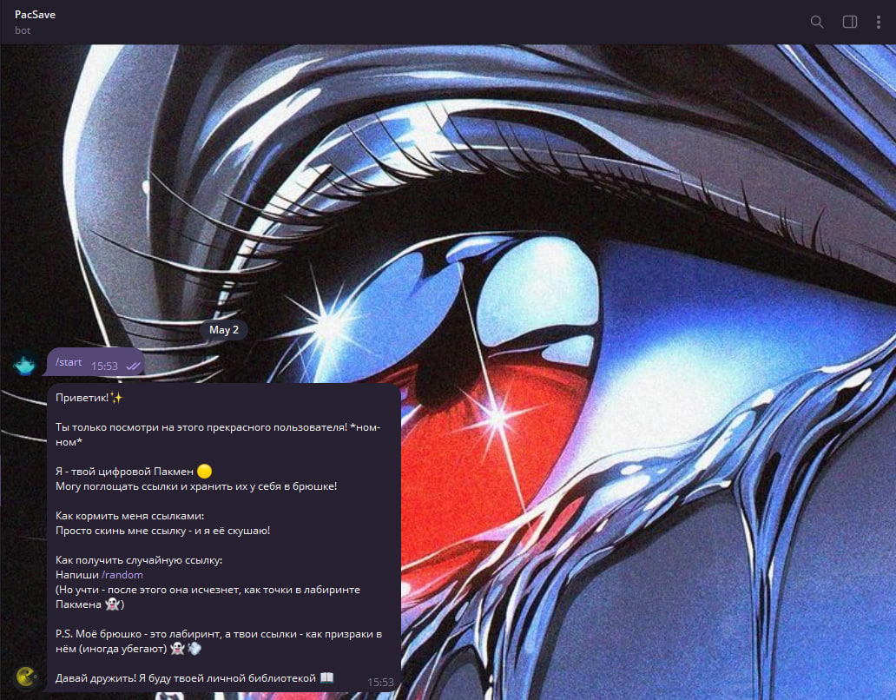
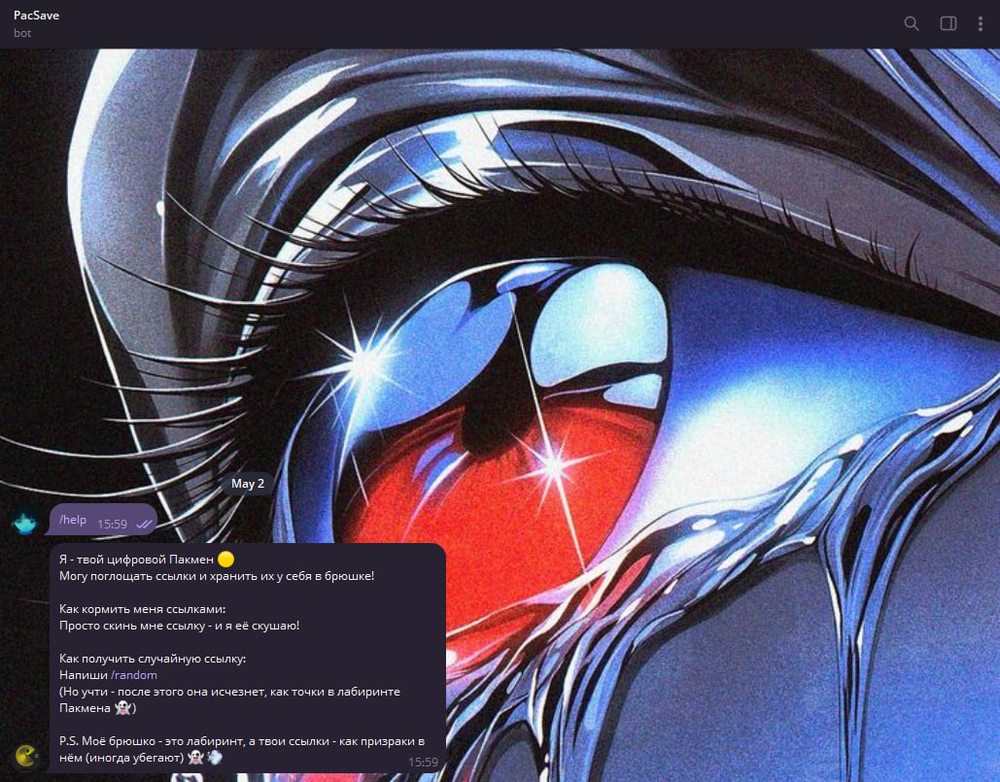
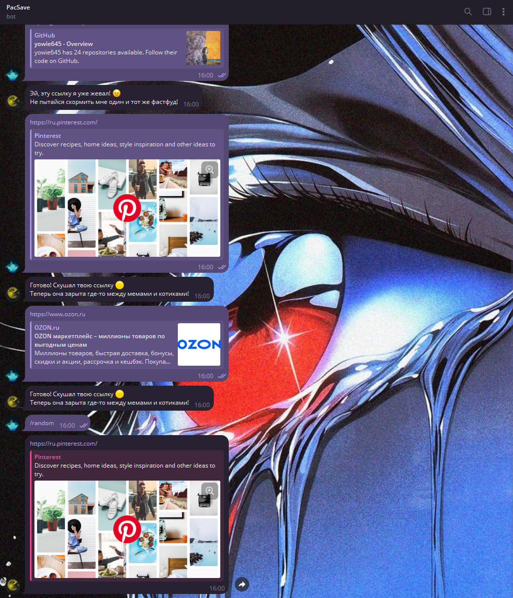
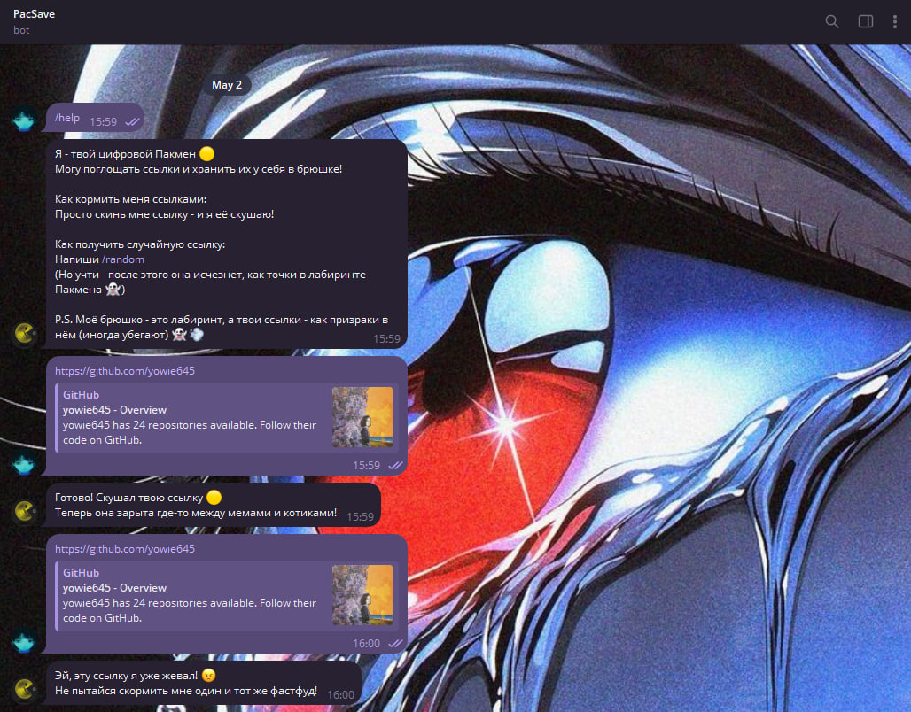
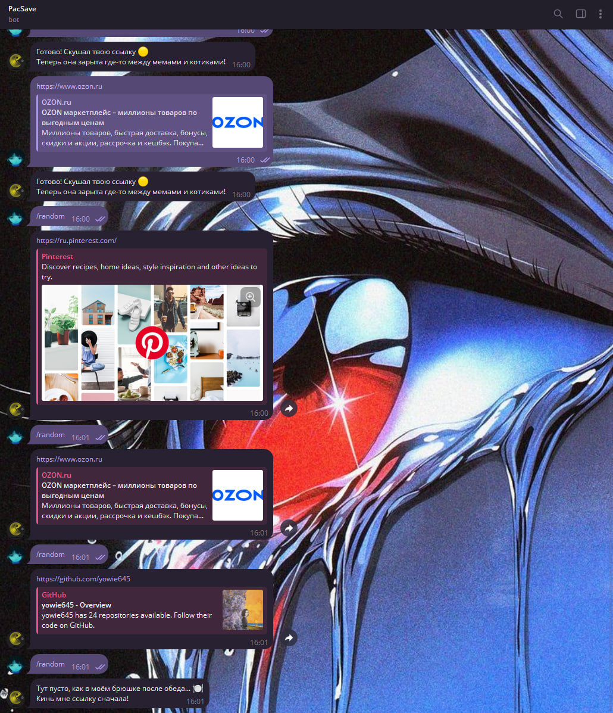

# 💫 About Project:

## 🧸 LinkSaverBot — Your Personal Telegram Bookmarking Assistant

LinkSaverBot is a lightweight, fast, and efficient Telegram bot written in **Go**, designed to help you effortlessly save and manage interesting links, articles, and resources right within your chat.

## 💻 Tech Stack:

 

### ✨ Key Features

- **Easy Link Saving:** Simply send or forward any URL to the bot, and it automatically saves it for you.
- **Smart Storage:** All your links are stored securely in a local **SQLite** database, ensuring quick and reliable access without any third-party dependencies.
- **Random Link Retrieval:** Feeling adventurous? Just type the command `/random` and the bot will send you one of your saved links picked at random — perfect for rediscovering forgotten gems.
- **Minimalist & Lightweight:** Built with Go, the bot is optimized for speed and low resource usage, making it ideal for running on small servers or even a Raspberry Pi.
- **Privacy Focused:** Your links stay private and stored only where you host the bot — no external tracking or sharing.

### 🎯 How It Works

- Forward or send any URL directly to the bot.
- The bot extracts the link and saves it in a local SQLite database.
- When you want some inspiration, just send the command `/random`.
- The bot instantly fetches and sends back a random saved link from your collection.

### 🚀 Why Use LinkSaverBot?

- Perfect for readers, researchers, and anyone who stumbles upon interesting content and wants an easy way to save it without juggling multiple apps.
- Stay organized without the hassle — your links are all in one place, accessible from anywhere via Telegram.
- Runs on your own infrastructure, putting you in full control over your data.

## 📸 Screenshots

### 🤖 Example of a bot interface

- **Command** `/start`

  
  _Welcome to the bot’s main menu — your gateway to effortless link saving and exploration._

- **Command** `/help`

  
  _Helpful instructions at your fingertips — learn how to save links quickly and efficiently._

- **Command** `/random`

  
  _Discover hidden treasures from your saved collection with a simple `/random` command._

  
  _Smart duplicate detection — the bot kindly lets you know if you've already saved that link._

_Friendly reminder when no links are saved yet — encouraging you to start your bookmarking journey!_

---

## 🛠️ Installation

### Prerequisites

- [Go 1.20+](https://golang.org/dl/)
- Telegram Bot Token (get from [@BotFather](https://t.me/BotFather))

## 🪭 Quick Setup

### Clone repository

- git clone https://github.com/yowie645/LinkSaverBot.git
- cd LinkSaverBot

### Configure bot token

- echo "BOT_TOKEN=your_token_here" > .env

### Run the bot

- go run main.go

Give LinkSaverBot a try and never lose track of your favorite links again!!
